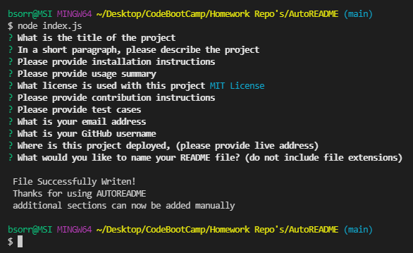

 
# AUTOREADME

## Table of Contents
* [Description](#description)
* [Installation](#installation)
* [Usage](#usage)
  * [License](#license) 
* [Contributing](#contributing)
* [Tests](#tests)
* [Questions](#questions)

----

## Description
This project was assigned as prt of the GTPE Coding Bootcamp to create an auto readme generator using Javascript, Node, and Inquirer

----

## Installation
This project requires the installation of node. copy the files "index.js" and the folder utils into the directory where you want the readme file. Also please have your project license text saved in a file named "LICENSE" as is the default when setting up a GitHub project.

----

## Usage
To use this command line tool. please first install inquirer by typing "npm intall" in the command line  to install the required node modules. This file project is dependent on node.js, inquirer.js and the provided generateMarkdown.js provided in the utils folder. 

After the required install, simpley run "node index.js" in the command line and answer the following prompts.

This README was generated using this project, with the exception of the added photos and video.

[Go To Live Project](https://github.com/BerlicTheHunter/AutoREADME)

## License
This project is licensed under MIT License and can be found [here](./LICENSE)

----

## Contributing
This project is not accepting contributions at this time

----

## Tests
None provided

----

## Questions
For any other questions, please the the provided links below
* [Github](https://github.com/BerlicTheHunter)
* [Email](mailto:bsorrell3@gmail.com)
